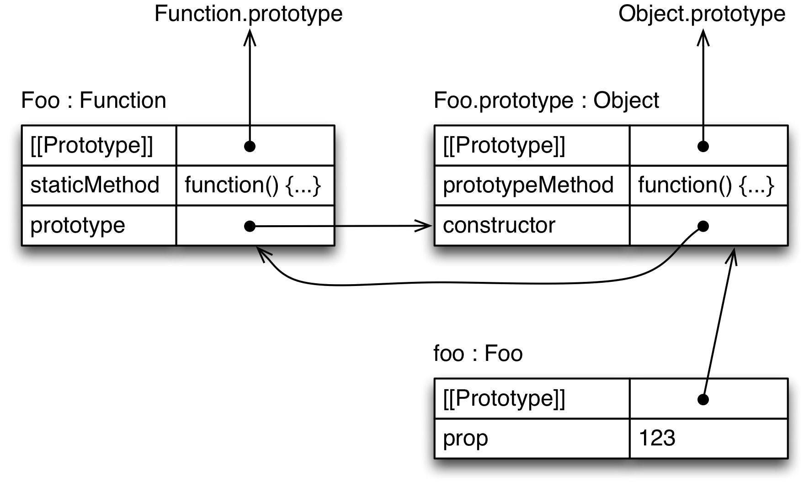

## 15.2 要点

### 15.2.1 基类

在 ECMAScript 6 （ ES6 ）中，类像这样定义：

```js
class Point {
    constructor(x, y) {
        this.x = x;
        this.y = y;
    }
    toString() {
        return `(${this.x}, ${this.y})`;
    }
}
```

这个类使用起来就像一个 ES5 的构造器函数一样：

```
> var p = new Point(25, 8);
> p.toString()
'(25, 8)'
```

实际上，类定义的结果就是一个函数：

```
> typeof Point
'function'
```

然而，只能通过 `new` 调用类，不能通过函数调用（原理在后面解释）：

```
> Point()
TypeError: Classes can’t be function-called
```

> 在规范中，类以函数调用方式使用的时候，会被函数对象[内部的方法 [[Call]]](http://www.ecma-international.org/ecma-262/6.0/#sec-ecmascript-function-objects-call-thisargument-argumentslist) 阻止。

#### 15.2.1.1 类声明不会被提升

函数声明会被提升：当进入一个作用域的时候，声明在里面的函数马上就可用了 - 不管函数声明在哪个位置。这意味着可以在函数声明之前调用：

```js
foo(); // works, because `foo` is hoisted

function foo() {}
```

相对地，类声明不会提升。因此，仅在执行到类定义的地方，并且执行完类定义代码，类才会存在。在类声明之前访问类会抛出 `ReferenceError` 错误：

```js
new Foo(); // ReferenceError

class Foo {}
```

这种限制的原因是类可以有一个`继承`子句，子句的值是任意表达式。这个表达式必须在正确的“地方”被执行，它的执行不能被提升。

没有提升功能导致的限制可能比你想象要少。例如，在类声明前面的函数依然能够访问那个类，但是必须要等到类声明已经被执行掉之后才能调用这个函数。

```js
function functionThatUsesBar() {
    new Bar();
}

functionThatUsesBar(); // ReferenceError
class Bar {}
functionThatUsesBar(); // OK
```

#### 15.2.1.2 类表达式

与函数类似，有两种类定义，两种方式定义一个类：类声明和类表达式。

同样地类似于函数，类表达式的标识符仅在当前表达式中可见：

```js
const MyClass = class Me {
    getClassName() {
        return Me.name;
    }
};
let inst = new MyClass();
console.log(inst.getClassName()); // Me
console.log(Me.name); // ReferenceError: Me is not defined
```

### 15.2.2 在类定义的主体内部

类的主体只能包含方法，不能有数据属性。原型上面的数据属性一般会被认为是反模式，因此这种做法仅强制执行了一种最佳实践。

#### 15.2.2.1 `构造器`，静态方法，原型方法

让我们检测一下类定义中常见的三种方法：

```js
class Foo {
    constructor(prop) {
        this.prop = prop;
    }
    static staticMethod() {
        return 'classy';
    }
    prototypeMethod() {
        return 'prototypical';
    }
}
let foo = new Foo(123);
```

该类声明的对象图看起来像下面这样。理解此图的小提示： `[[Prototype]]` 在对象之间是继承关系， `prototype` 是一个普通的值为对象的属性。属性 `prototype` 仅仅是比较特殊，因为 `new` 操作符使用它的值作为新创建实例的原型。



**首先，伪方法 `constructor` 。**这个方法很特殊，它定义了代表这个类的函数：

```
> Foo === Foo.prototype.constructor
true
> typeof Foo
'function'
```

有时称它为`类构造器`。它有一些普通构造器函数所不具备的特性（主要是能通过 `super()` 调用父构造器，这在后面讲解）。

**其次，静态方法。**静态属性（或者说是类属性）就是 `Foo` 自身上面的属性。如果定义方法的时候在前面加上 `static` ，就创建了一个类方法：

```
> typeof Foo.staticMethod
'function'
> Foo.staticMethod()
'classy'
```

**第三点，原型方法。** `Foo` 的原型属性就是 `Foo.prototype` 的属性。它们是常用的方法，并被 `Foo` 的实例继承。

```
> typeof Foo.prototype.prototypeMethod
'function'
> foo.prototypeMethod()
'prototypical'
```

#### 15.2.2.2 静态数据属性

到目前为止，类只允许创建静态方法，不能创建静态数据属性。有两种方法可以解决这个问题。

第一个，可以手动地添加一个静态属性：

```js
class Point {
    constructor(x, y) {
        this.x = x;
        this.y = y;
    }
}
Point.ZERO = new Point(0, 0);
```

第二个，创建一个静态的 getter ：

```js
class Point {
    constructor(x, y) {
        this.x = x;
        this.y = y;
    }
    static get ZERO() {
        return new Point(0, 0);
    }
}
```

在两种场景中，都得到一个能读取的属性 `Point.ZERO` 。在第一种方法中，可以使用 `Object.defineProperty()` 创建一个只读的属性，但是我喜欢赋值的简洁性。

#### 15.2.2.3 getters 和 setters

getters 和 setters 的语法和 [ECMAScritp 5 中的对象字面量语法](http://speakingjs.com/es5/ch17.html#getters_setters)是类似的：

```js
class MyClass {
    get prop() {
        return 'getter';
    }
    set prop(value) {
        console.log('setter: '+value);
    }
}
```

你可以像下面这样使用 `MyClass` 。

```
> let inst = new MyClass();
> inst.prop = 123;
setter: 123
> inst.prop
'getter'
```

#### 15.2.2.4 计算的方法名字

可以通过表达式定义方法名字，需要把表达式放在一对中括号中。例如，下面定义 `Foo` 的所有方式都是等价的。

```js
class Foo() {
    myMethod() {}
}

class Foo() {
    ['my'+'Method']() {}
}

const m = 'myMethod';
class Foo() {
    [m]() {}
}
```

ECMAScript 6 中有几个特殊的方法，这些方法的键是 Symbol 。计算方法名字让你能够定义这种方法。例如，如果一个对象有一个方法，这个方法的键是 `Symbol.iterator` ，那么这个对象就是可迭代的。这意味着它的内容可以通过 `for-of` 循环和其它语言机制来迭代。

```js
class IterableClass {
    [Symbol.iterator]() {
        ···
    }
}
```

#### 15.2.2.5 生成器函数

如果在方法定义的时候加上一个星号前缀，那么这个方法就会变成生成器方法。在其它方面，生成器对于定义键是 `Symbol.iterator` 的方法是很有用的。下面的代码展示了如何运作。

```js
class IterableArguments {
    constructor(...args) {
        this.args = args;
    }
    * [Symbol.iterator]() {
        for (let arg of this.args) {
            yield arg;
        }
    }
}

for (let x of new IterableArguments('hello', 'world')) {
    console.log(x);
}

// Output:
// hello
// world
```

### 15.2.3 子类

继承子句让你能够创建已有构造器（这个构造器可能是通过类的形式创建的，也可能不是）的子类：

```js
class Point {
    constructor(x, y) {
        this.x = x;
        this.y = y;
    }
    toString() {
        return `(${this.x}, ${this.y})`;
    }
}

class ColorPoint extends Point {
    constructor(x, y, color) {
        super(x, y); // (A)
        this.color = color;
    }
    toString() {
        return super.toString() + ' in ' + this.color; // (B)
    }
}
```

该类的使用和想象的一样：

```
> let cp = new ColorPoint(25, 8, 'green');
> cp.toString()
'(25, 8) in green'

> cp instanceof ColorPoint
true
> cp instanceof Point
true
```

有两种类：

* `Point` 是一个基类，因为它没有继承子句。
* `ColorPoint` 是一个继承类。

有两种使用 `super` 的方式：

* 在类构造器（类定义中的伪方法 `constructor` ）中使用它就像方法调用一样（ `super(...)` ），用于调用父构造器（行 A ）。
* 在方法定义（在对象字面量或者类中，带有或者不带 `static` ）中使用它就像属性引用（ `super.prop` 或者方法调用（ `super.method(...)` ）），用于访问父属性（行 B ）。

#### 15.2.3.1 子类的原型是父类

在 ECMAScript 6 中，子类的原型是父类：

```
> Object.getPrototypeOf(ColorPoint) === Point
true
```

这意味着静态属性是会被继承的：

```js
class Foo {
    static classMethod() {
        return 'hello';
    }
}

class Bar extends Foo {
}
Bar.classMethod(); // 'hello'
```

甚至可以通过 `super` 调用父类中的静态方法：

```js
class Foo {
    static classMethod() {
        return 'hello';
    }
}

class Bar extends Foo {
    static classMethod() {
        return super.classMethod() + ', too';
    }
}
Bar.classMethod(); // 'hello, too'
```

#### 15.2.3.2 父构造器调用

在一个继承类里面， `super()` 调用必须先于 `this` 的使用：

```js
class Foo {}

class Bar extends Foo {
    constructor(num) {
        let tmp = num * 2; // OK
        this.num = num; // ReferenceError
        super();
        this.num = num; // OK
    }
}
```

在继承的构造器中不调用 `super()` 也会造成错误：

```js
class Foo {}

class Bar extends Foo {
    constructor() {
    }
}

let bar = new Bar(); // ReferenceError
```

#### 15.2.3.3 覆盖构造器的结果

就像在 ES5 中一样，可以通过显示地返回一个对象来覆盖构造器的结果：

```js
class Foo {
    constructor() {
        return Object.create(null);
    }
}
console.log(new Foo() instanceof Foo); // false
```

如果这样做了，那么 `this` 是否已经被初始化都没关系了。换句话说，如果用这种方式覆盖结果，那么在继承的构造函数中没必要调用 `super()` 方法了。

#### 15.2.3.4 类的默认构造器

如果没有为基类指定`构造器`，那么会使用下面的定义：

```js
constructor() {}
```

对于继承类，会使用下面的默认构造器：

```js
constructor(...args) {
    super(...args);
}
```

#### 15.2.3.5 子类化内置构造器

在 ECMAScript 6 中，可以继承所有内置的构造器（ [ES5 中有相应的变通手段](http://speakingjs.com/es5/ch28.html)，但是有值得注意的限制）。

例如，现在可以创建自己的异常类（在大多数引擎中会继承堆栈特性）：

```js
class MyError extends Error {
}
throw new MyError('Something happened!');
```

也可以创建 `Array` 的子类，该子类也会正确地处理 `length` ：

```js
class MyArray extends Array {
    constructor(len) {
        super(len);
    }
}

// Instances of of `MyArray` work like real Arrays:
let myArr = new MyArray(0);
console.log(myArr.length); // 0
myArr[0] = 'foo';
console.log(myArr.length); // 1
```

注意，子类化内置构造器需要引擎本地化的支持，不能从转换器中得到这个特性。