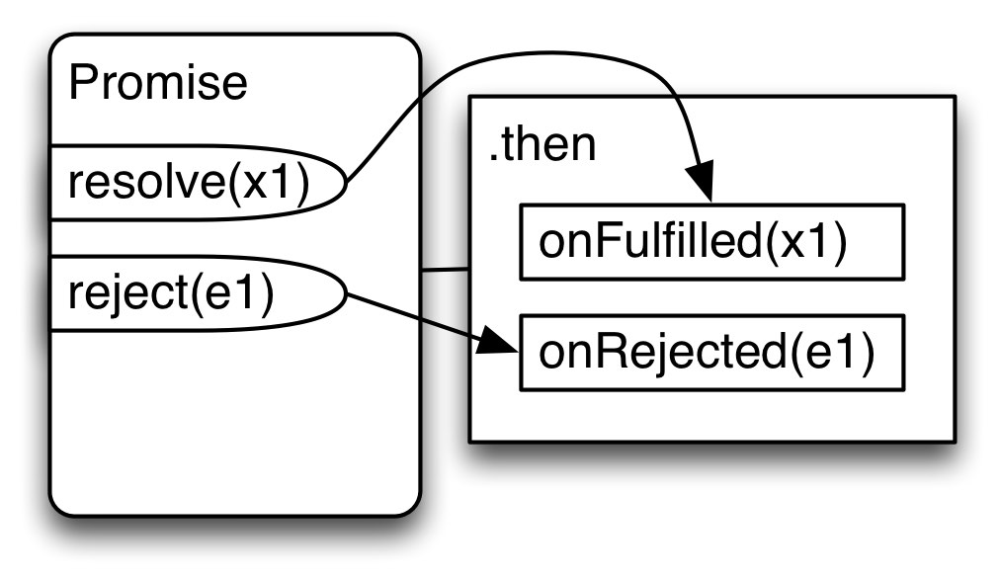
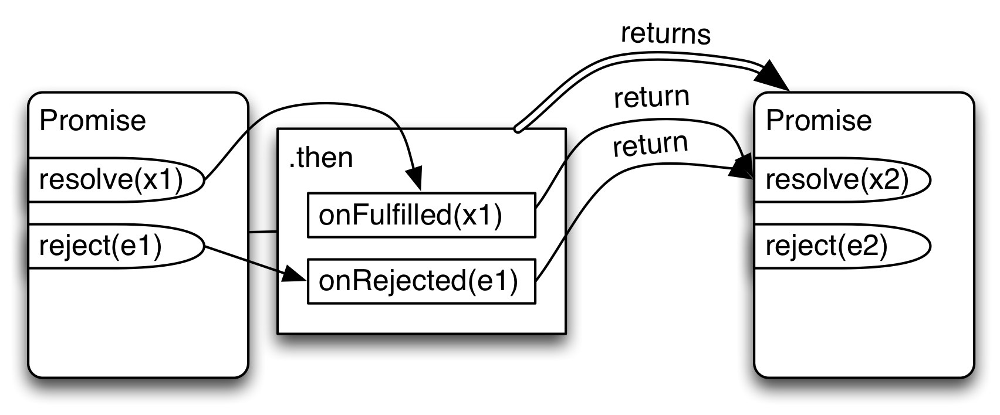
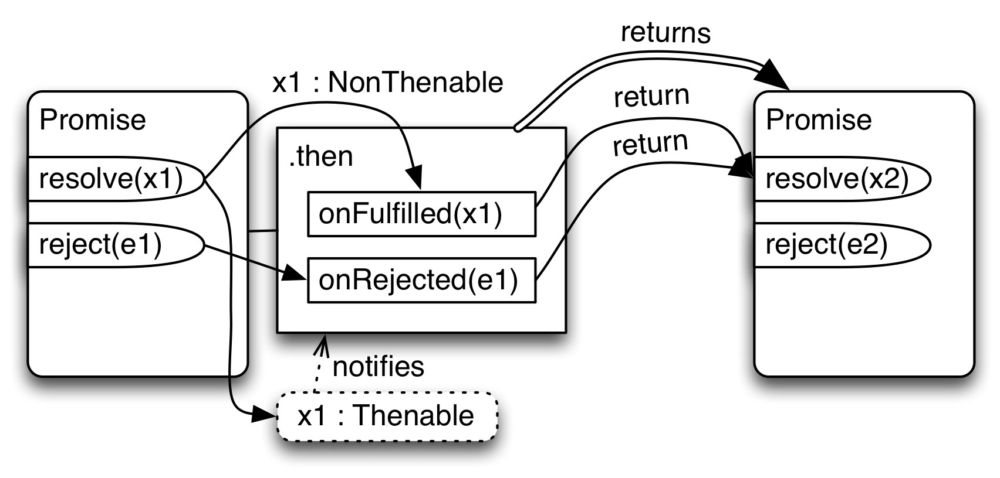
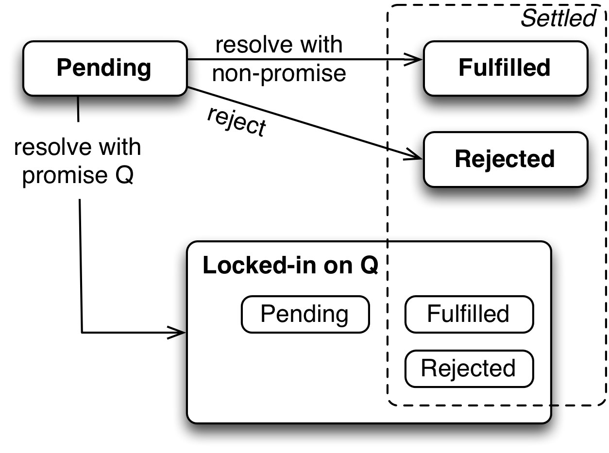
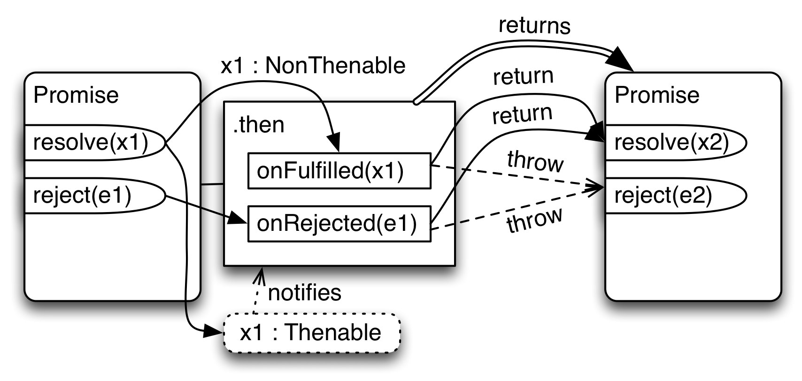
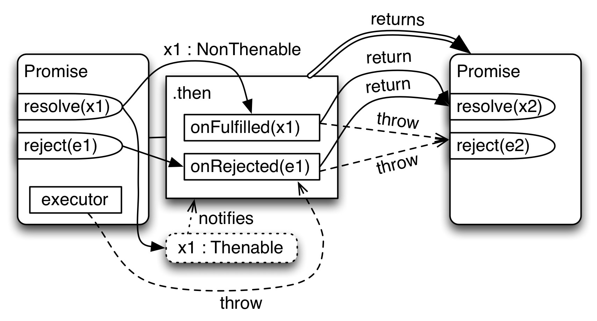

## 24.13 Promise 内部机制

本节中，我们将会从一个不一样的角度来学习 Promise ：我们将会简单实现 Promise ，而不是学习如何使用 Promise API 。这种不同的视角很大程度地帮助我理解了 Promise 。

此处 Promise 的实现叫做 `DemoPromise` 。为了理解起来更容易，并没有完全符合 ES6 的 Promise API 。但是仍然足以说明实际的 Promise 实现会遇到什么挑战。

> `DemoPromise` 可以在 GirHub 上找到，位于仓库 [demo_promise](https://github.com/rauschma/demo_promise) 中。

`DemoPromise` 是有三个原型方法的类：

* `DemoPromise.prototype.resolve(value)`
* `DemoPromise.prototype.reject(reason)`
* `DemoPromise.prototype.then(onFulfilled, onRejected)`

也就是说， `resolve` 和 `reject` 是方法（比较传递给构造函数 Promise 的回调函数的参数）。

### 24.13.1 一个独立的 Promise

第一个实现是一个独立的 Promise ，只有最少的功能：

* 可以创建 Promise
* 可以通过（ resolve ）或者拒绝（ reject ）一个 Promise ，并且只能做一次。
* 可以通过 `then()` 注册应答器（回调函数）。这一定要与 Promise 是否已经稳定无关。
    * 该方法暂不支持链式使用 - 不反悔任何东西。

下面是如何使用第一个版本的 Promise ：

```js
let dp = new DemoPromise();
dp.resolve('abc');
dp.then(function (value) {
    console.log(value); // abc
});
```

下图说明了我们的第一个 `DemoPromise` 是如何工作的：



#### 24.13.1.1 `DemoPromise.prototype.then()`

首先检查 `then()` 。该方法处理两种情形：

* 如果 Promise 还处于 `pending` 状态，则会将 `onFulfilled` 和 `onRejected` 的调用存储在队列中，当 Promise 稳定下来的时候就使用。
* 如果 Promise 已经处于 fulfilled 状态或者 rejected 状态， `onFulfilled` 或者 `onRejected` 可能会被立刻调用。

```js
then(onFulfilled, onRejected) {
    let self = this;
    let fulfilledTask = function () {
        onFulfilled(self.promiseResult);
    };
    let rejectedTask = function () {
        onRejected(self.promiseResult);
    };
    switch (this.promiseState) {
        case 'pending':
            this.fulfillReactions.push(fulfilledTask);
            this.rejectReactions.push(rejectedTask);
            break;
        case 'fulfilled':
            addToTaskQueue(fulfilledTask);
            break;
        case 'rejected':
            addToTaskQueue(rejectedTask);
            break;
    }
}
```

上面的代码片段使用了下面的辅助函数：

```js
function addToTaskQueue(task) {
    setTimeout(task, 0);
}
```

#### 24.13.1.2 `DemoPromise.prototype.resolve()`

`resolve()` 像下面这样工作：如果 Promise 已经稳定了，什么事也不做（确保 Promise 只能变为稳定状态一次）。否则， Promise 的状态变为 `fulfilled` ，结果缓存在 `this.promiseResult` 中。接下来，触发所有之前存放的 fulfilled 状态相关的回调函数。

```js
resolve(value) {
    if (this.promiseState !== 'pending') return;
    this.promiseState = 'fulfilled';
    this.promiseResult = value;
    this._clearAndEnqueueReactions(this.fulfillReactions);
    return this; // enable chaining
}
_clearAndEnqueueReactions(reactions) {
    this.fulfillReactions = undefined;
    this.rejectReactions = undefined;
    reactions.map(addToTaskQueue);
}
```

`reject()` 类似于 `resolve()` 。

### 24.13.2 链式

接下来要实现的特性是链式：

* `then()` 返回一个 Promise ，它通过 `onFulfilled` 或 `onRejected` 的返回来变成 `resolved` 状态。
* 如果省略 `onFulfiled` 或 `onRejected` ，那么不管接收到什么，都会传给 `then()` 返回的 Promise 。



很明显，只需要修改 `then()` ：

```js
then(onFulfilled, onRejected) {
    let returnValue = new Promise(); // (A)
    let self = this;

    let fulfilledTask;
    if (typeof onFulfilled === 'function') {
        fulfilledTask = function () {
            let r = onFulfilled(self.promiseResult);
            returnValue.resolve(r); // (B)
        };
    } else {
        fulfilledTask = function () {
            returnValue.resolve(self.promiseResult); // (C)
        };
    }

    let rejectedTask;
    if (typeof onRejected === 'function') {
        rejectedTask = function () {
            let r = onRejected(self.promiseResult);
            returnValue.resolve(r); // (D)
        };
    } else {
        rejectedTask = function () {
            // `onRejected` has not been provided
            // => we must pass on the rejection
            returnValue.reject(self.promiseResult); // (E)
        };
    }
    ···
    return returnValue; // (F)
}
```

`then()` 创建并返回了一个新的 Promise （行 A 和 F）， `fulfilledTask` 和 `rejectedTask` 被分别设置：在稳定之后……

* `onFulfilled` 的返回值传入 `returnValue` 的 resolve 方法（行 B ）。
    * 如果没有传入 `onFulfilled` ，就将当前已经完成的值传入 `returnValue` 的 resolve 方法（行 C ）。
* `onRejected` 的返回值传入 `returnValue` 的 resolve 方法（不是 reject 方法！）（行 D ）。
    * 如果没有传入 `onRejected` ，就将当前已经完成的值传入 `returnValue` 的 reject 方法（行 E ）。

### 24.13.3 扁平化（ Flattening ）

扁平化主要让链式调用更加方便：通常情况下，将响应器（ reaction ）返回的值传给下一个 `then()` 。如果返回一个 Promise ，并且内部并没有做相应的“包装”，这种情形是非常美好的，就像下面的例子：

```js
asyncFunc1()
.then(function (value1) {
    return asyncFunc2(); // (A)
})
.then(function (value2) {
    // value2 is fulfillment value of asyncFunc2() Promise
    console.log(value2);
});
```

在行 A 返回一个 Promise ，没必要将下一个 `then()` 内嵌到当前方法中，可以在当前方法的返回值上调用 `then()` 。所以：没有内嵌的 `then()` ，所有内容保持扁平。

通过 `resolve()` 方法实现这种扁平功能：

* 用 Promise Q 来解析 Promise P 意味着 Q 的稳定情况会转发给 P 。
* P 被“锁在了” Q 上：不能再手动变为 resolved 状态（同样也不能变为 rejected 状态）。它的状态和结果总是和 Q 保持一致。

如果让 Q 变成 thenable 对象（而不仅仅是一个 Promise ），那么就可以让扁平化更加通用，



为了实现锁定，引入一个新的布尔标志 `this.alreadyResolved` 。一旦该值变为 `true` ， `this` 就被锁定了，不能再被解析（ resolve ）了。注意此时 `this` 可能还处于 `pending` 状态，因为它的状态现在和锁定到的 Promise 一致。

```js
resolve(value) {
    if (this.alreadyResolved) return;
    this.alreadyResolved = true;
    this._doResolve(value);
    return this; // enable chaining
}
```

实际的解析过程现在发生在私有的方法 `_doResolve()` 中：

```js
_doResolve(value) {
    let self = this;
    // Is `value` a thenable?
    if (typeof value === 'object' && value !== null && 'then' in value) {
        // Forward fulfillments and rejections from `value` to `this`.
        // Added as a task (vs. done immediately) to preserve async semantics.
        addToTaskQueue(function () { // (A)
            value.then(
                function onFulfilled(result) {
                    self._doResolve(result);
                },
                function onRejected(error) {
                    self._doReject(error);
                });
        });
    } else {
        this.promiseState = 'fulfilled';
        this.promiseResult = value;
        this._clearAndEnqueueReactions(this.fulfillReactions);
    }
}
```

在行 A 处理了扁平化：如果 `value` 是 fulfilled 状态，我们希望 `self` 也是 fulfilled 状态；如果 `value` 是 rejected 状态，我们希望 `self` 也是 rejected 状态。通过私有方法 `_doResolve` 和 `_doReject` 不停转发，绕过 `alreadyResolved` 标志。

### 24.13.4 Promise 状态的更多细节

实现链式特性之后， Promise 的状态更加复杂了（正如 ECMAScript 6 规范的[25.4节](http://www.ecma-international.org/ecma-262/6.0/#sec-promise-objects)描述的那样）：



如果你仅使用 Promise ，通常你可以采用一种简单的方式，忽略掉锁定。最重要的状态相关的概念仍然是“稳定（ settledness ）”：一个 Promise 在变为 fulfilled 状态或 rejected 状态，就稳定了。在 Promise 稳定之后，就不再会变化了（状态和最终的值都不会变化）。

如果你想实现 Promise ，那么“解析（ resolving ）”也很重要，并且现在很难理解：

* 直观地，“ resolved ”的意思是“不能再被（直接地）解析了”。如果一个 Promise 稳定了或者锁定了，那么就变成了 `resolved` 状态。引用规范里面的话：“一个未解析（ unresolved ）的 Promise 总是处于 pending 状态。一个解析（ resolved ）的 Promise 可能是 pending 状态，也可能是 fulfilled 或 rejected 状态”。
* 解析（ resolving ）不一定会使 Promise 变为稳定状态：你可以用另外一个总是处于 pending 状态的 Promise 来解析某个 Promise 。
* 解析（ resolving ）现在包括了拒绝（ rejecting ）（即更一般化了）：你可以通过一个处于 rejected 状态的 Promise 来解析某个 Promise ，从而使其也变为 rejected 状态。

### 24.13.5 异常

最后一个特性，我们希望在用户代码抛出异常的时候进入拒绝（ rejection ）回调函数。此处，“用户代码”指的是 `then()` 的两个回调参数。



下面的代码展示了我们如何将 `onFulfilled` 中抛出的异常转移到拒绝回调函数中 - 通过在行 A 用 `try-catch` 包裹 `onFulfilled` 的调用。

```js
then(onFulfilled, onRejected) {
    ···
    let fulfilledTask;
    if (typeof onFulfilled === 'function') {
        fulfilledTask = function () {
            try {
                let r = onFulfilled(self.promiseResult); // (A)
                returnValue.resolve(r);
            } catch (e) {
                returnValue.reject(e);
            }
        };
    } else {
        fulfilledTask = function () {
            returnValue.resolve(self.promiseResult);
        };
    }
    ···
}
```

### 24.13.6 启发性的构造器模式

如果我们想将 `DemoPromise` 变成一个实际可用的 Promise 实现，还需要实现[启发性的构造器模式[5]](https://leanpub.com/exploring-es6/read#ch_promises_ref_5)： ES6 的 Promise 不通过方法来解析（ resolve ）和拒绝（ reject ），而是通过传递给执行器（ executor ）的函数，即构造器的回调参数。



如果执行器抛出异常，那么对应的 Promise 就会变为 rejected 状态。

