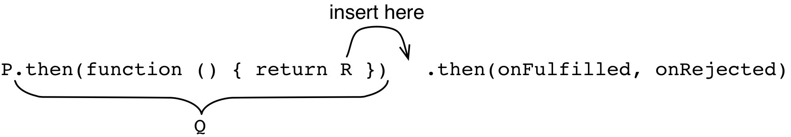

## 24.6 链式使用 Promise

现在已经准备好深入 Promise 特性了。首先探索一下如何链式使用 Promsie 。

方法调用的结果：

```js
P.then(onFulfilled, onRejected)
```

是一个新的 Promise Q 。这意味着你可以通过在 Q 上调用 `then()` 来维持基于 Promise 的控制流：

* 如果 `onFulfilled` 或 `onRejected` 成功返回，则 Q 变为 fulfilled 状态，相应的结果值就是前面函数的返回值。
* 如果 `onFulfilled` 或 `onRejected` 抛出异常，则 Q 变为 rejected 状态。

### 24.6.1 用普通的值将 Q 置为 fulfilled 状态

如果用一个普通的值将 `then()` 返回的 Promise Q 置为 fulfilled 状态，可以追加一个 `then()` 来得到那个值：

```js
asyncFunc()
.then(function (value1) {
    return 123;
})
.then(function (value2) {
    console.log(value2); // 123
});
```

### 24.6.2 用带有 then 方法的对象将 Q 置为 fulfilled 状态

也可以用带有 then 方法的对象 R 将 `then()` 返回的 Promise Q 置为 fulfilled 状态。可 then 化（ thenable ）实体就是任何一个有 Promise 风格方法 `then()` 的对象。因此， Promise 是可 then 化的。用 R 置为 fulfilled 状态（例如在 `onFulfilled` 中返回 R ）意味着 R 被插在 Q “后面”： R 的稳定消息会转发给 Q 的 `onFulfilled` 和 `onRejected` 回调。在某种程度上， Q 变成了 R 。



这种机制的主要用途就是扁平化内嵌的 `then()` 调用，就像下面的例子：

```js
asyncFunc1()
.then(function (value1) {
    asyncFunc2()
    .then(function (value2) {
        ···
    });
})
```

扁平化的版本看起来像这样：

```js
asyncFunc1()
.then(function (value1) {
    return asyncFunc2();
})
.then(function (value2) {
    ···
})
```

### 24.6.3 从 `onRejected` 将 Q 置为 fulfilled 状态

在错误处理器中返回的内容变成了一个成功完成的值（而不是被驳回的值）。这使得可以在执行失败的时候指定默认值：

```js
retrieveFileName()
.catch(function () {
    // Something went wrong, use a default value
    return 'Untitled.txt';
})
.then(function (fileName) {
    ···
});
```

### 24.6.4 通过抛出异常将 Q 置为 rejected 状态

在 `then()` 的两个回调参数中抛出的异常会传递给下一个错误处理器：

```js
asyncFunc()
.then(function (value) {
    throw new Error();
})
.catch(function (reason) {
    // Handle error here
});
```

### 24.6.5 执行者中的异常

在执行者（ `new Promise()` 的回调）中抛出的异常传递给该执行者负责管理的 Promise ：

```js
new Promise(function (resolve, reject) {
    throw new Error();
})
.catch(function (err) {
    // Handle error here
});
```

### 24.6.6 链式错误

可以有一个或多个 `then()` 方法调用，并且这些方法调用中都没有传递错误处理器。此时错误就会一直往下传递，直到遇见一个错误处理器。

```js
asyncFunc1()
.then(asyncFunc2)
.then(asyncFunc3)
.catch(function (reason) {
    // Something went wrong above
});
```
