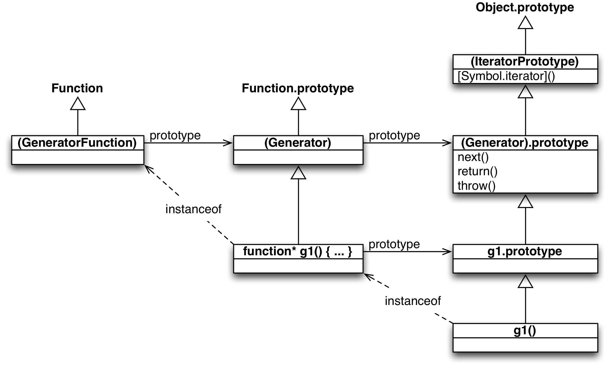

## 21.7 基于迭代 API 的继承关系（包含生成器）

下面的图展示了在 ECMAScript 6 中各种对象之间的关系（此图基于 ECMAScript 规范中 [Allen Wirf-Brock 的图](http://www.ecma-international.org/ecma-262/6.0/#sec-generatorfunction-objects)）：



说明：

* 空心箭头表示两个对象的继承关系。换句话说，从 x 指向 y 的箭头意味着 `Object.getPrototypeOf(x) === y` 。
* 圆括号表示当前被包起来的对象是存在的，但是不能通过全局变量来访问。
* 带有 `instanceof` 字眼的箭头如果从 x 指向 y ，就表明 `x instanceof y` 。
    * `o instanceof C` 实际上就相当于 `C.prototype.isPrototypeOf(o)`
* 带有 `prototype` 字眼的箭头如果从 x 指向 y ，就表明 `x.prototype === y` 。

此图揭示了两个有趣的事实：

第一个，生成器函数 `g` 很像构造函数（甚至可以通过 new 来调用它，这和直接调用的效果是一样的）：它创建的生成器对象是它的实例，添加到 `g.prototype` 上的方法成为原型方法，等等：

```
> function* g() {}
> g.prototype.hello = function () { return 'hi!'};
> let obj = g();
> obj instanceof g
true
> obj.hello()
'hi!'
```

第二个，如果你想给所有的生成器对象添加方法，最好将这些方法添加到 `(Generator.object)` 上。访问这个对象的一种方式如下：

```
> let Generator_prototype = Object.getPrototypeOf(function* () {}).prototype;
> Generator_prototype.hello = function () { return 'hi!'};
> let generatorObject = (function* () {})();
> generatorObject.hello()
'hi!'
```


